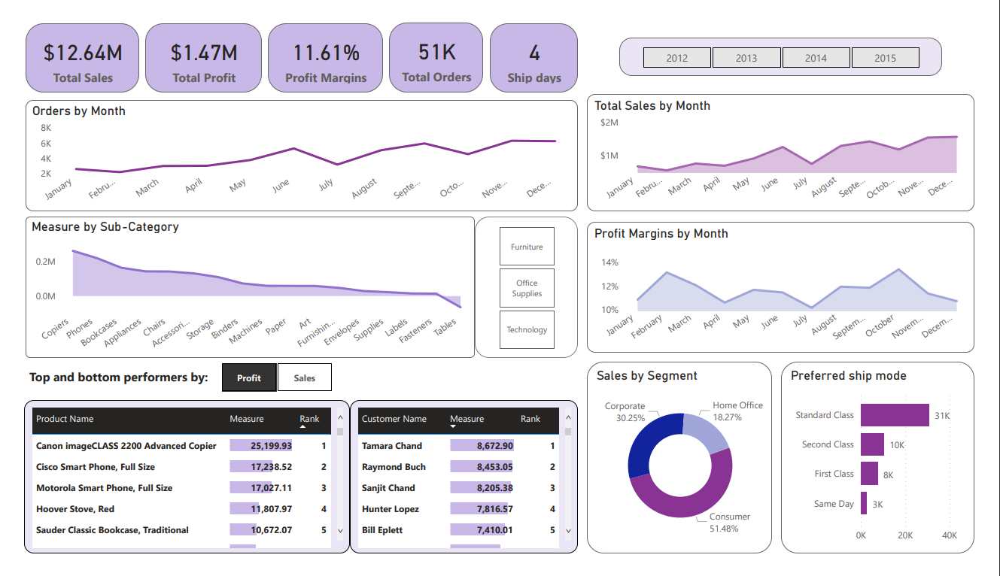

# Global-store-dataset 

## Description
I used a global store dataset from kaggle and imported it into Microsoft PowerBI. It contained three tables namely orders, returns and people. The orders table consisted of columns Row ID, Order ID, Order Date, Ship Date, Ship Mode, Customer ID, Customer Name, Segment, Postal Code, City, State, Country, Region, Market, Product ID, Category, Sub-Category, Product Name, Sales, Quantity, Discount, Profit, Shipping Cost and Order Priority. Returns table consisted of columns returned, orderID and Region. People table consisted of columns Person and Region. Then created four dimension tables namely customer, product, shipmode and order from the orders table, making it a fact table. After this, linked the fact table to these dimension tables using foreign and surrogate keys, also linked returns table to the order dimension table and people table to the customer dimension table. Thus, implemented a snowflake schema for optimizing and facilitating complex data relationships.
Also performed data cleaning and data transformation tasks like:  
* Removing columns
* Renaming and reordering columns
* Promoting headers
* Changing the type
* Adding custom column
* Adding index 
* Merging queries
* Removing duplicates and so on.  

Lastly, i did some data analysis and data visualization by: 
* Creating multiple measures to analyze key performance indicators (KPIs) such as sales, profits, and order trends.
* Built a variety of visualizations, including cards for KPI summaries, line and bar graphs for sales and profit trends, and table visuals for top and bottom performers.
* Refined the visualizations by providing interactivity and drill-down capabilities, allowing users to explore the data from different perspectives. 
* Incorporated interactive filters, slicers, and dynamic measures to enhance the user experience.

## Dashboard

